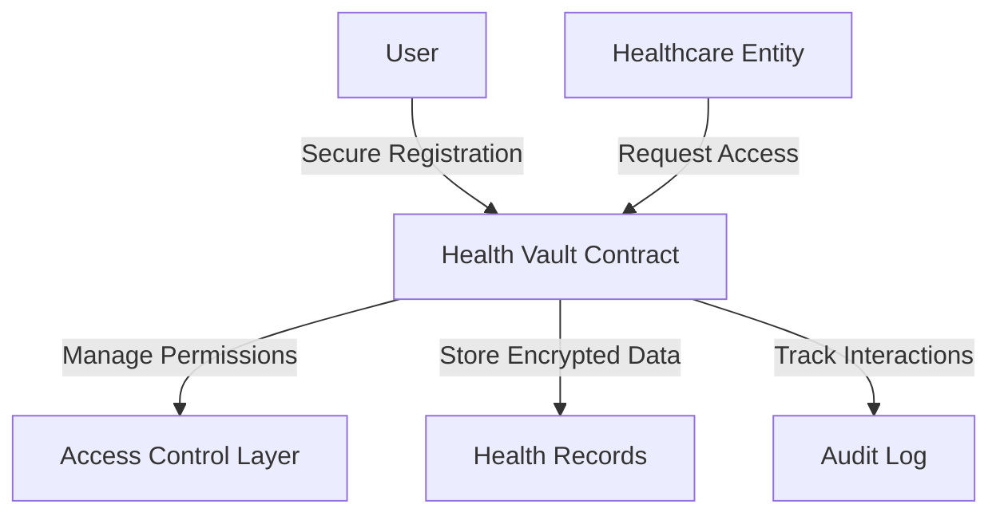

# init-l2: Decentralized Health Data Vault

A privacy-preserving, secure health information management platform built on the Stacks blockchain, empowering users with complete control over their medical data.

## Overview

init-l2 provides a cutting-edge solution for managing personal health information with unparalleled security, privacy, and user autonomy. Our platform enables:

- Encrypted storage of diverse health metrics
- Granular, permission-based data sharing
- Secure, transparent access controls
- Immutable audit trails
- Decentralized healthcare data management

## Architecture

The init-l2 platform revolves around a sophisticated smart contract designed to manage health data with maximum privacy and control.



### Key Components
- **Users**: Complete ownership and management of health data
- **Healthcare Entities**: Controlled, transparent data interaction
- **Access Permissions**: Fine-grained, time-limited data sharing
- **Audit Mechanism**: Comprehensive, immutable access tracking

## Contract Documentation

### Health Vault Contract

The core contract (`health-vault.clar`) implements advanced health data management:

#### Core Data Structures
- `user-profiles`: User registration and emergency settings
- `healthcare-entities`: Verified medical organizations
- `health-records`: Encrypted medical information
- `access-permissions`: Detailed data sharing controls
- `access-audit-log`: Comprehensive interaction tracking

#### Key Functions

##### User Management
```clarity
(define-public (register-user (encrypted-profile-url (optional (string-utf8 256))))
(define-public (register-healthcare-entity (entity-name (string-utf8 100)) (entity-type (string-utf8 50)))
```

##### Data Handling
```clarity
(define-public (add-health-record 
  (record-type (string-utf8 50))
  (encrypted-data (string-utf8 1024))
  (large-data-reference (optional (string-utf8 256)))
  (data-checksum (string-utf8 64))
)
```

##### Access Control
```clarity
(define-public (grant-data-access 
  (accessor principal) 
  (data-types (list 20 (string-utf8 50)))
  (expiration (optional uint))
)
```

## Getting Started

### Prerequisites
- Clarinet
- Stacks wallet
- Node.js environment

### Installation

1. Clone the repository
2. Install dependencies with Clarinet
```bash
clarinet integrate
```

### Usage Examples

1. Register as a user:
```clarity
(contract-call? .looppulse-core register-user (some "https://example.com/profile"))
```

2. Add health data:
```clarity
(contract-call? .looppulse-core add-health-data "heart-rate" "encrypted_data_here" none "checksum_here")
```

3. Grant access to a provider:
```clarity
(contract-call? .looppulse-core grant-access 'PROVIDER_ADDRESS (list "heart-rate" "blood-pressure") (some u100))
```

## Security Considerations

1. Data Encryption
   - All health data must be encrypted before storage
   - Only encrypted data URLs should be stored on-chain

2. Access Control
   - Regular audit of access permissions
   - Immediate revocation of compromised permissions
   - Time-limited access grants

3. Emergency Access
   - Carefully manage emergency contact settings
   - Regular verification of emergency access configuration

4. Provider Verification
   - Healthcare providers must be verified before accessing data
   - Regular review of provider credentials

## Development

### Testing

Run the test suite:
```bash
clarinet test
```

### Local Development

1. Start local Clarinet console:
```bash
clarinet console
```

2. Deploy contracts:
```bash
clarinet deploy
```

### Key Considerations

- Always verify transaction signatures
- Implement proper error handling
- Monitor gas costs for large operations
- Regular security audits
- Keep encrypted data backups off-chain